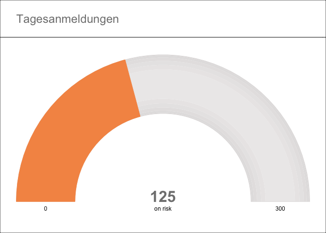

Simple Gauge Charts
================
Matthias Kornexl
November 20, 2017

The package provides a function to plot simple gauge charts. It mimics the features of the flexdashboards-package's gaugeChart function to produce gauge charts for any output device supported by R's standard graphics facilities.

``` r
library(gridGaugeChart)
sectors <- gaugeChartSectors(200, 100, 0, rev = TRUE)
gaugeChart(125, 0, 300, header = 'Tagesanmeldungen',
           sectors = sectors, label = 'on risk')
```


